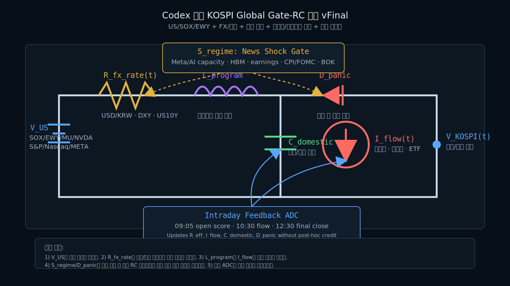

# KakaoPay Securities KOSPI Regime MCP

카카오페이증권 사용자가 KOSPI 급변 원인을 이해하도록 돕는 설명 가능한 시장 레짐 분석 MCP입니다.

투자 추천이나 자동매매가 아니라, 미국장·EWY·반도체주·뉴스·수급을 전기회로 모델로 변환해 시가/종가 레짐과 근거를 설명합니다.

관련하여 NotebookLM으로 제작 과정을 정리했습니다.

[NotebookLM 제작 과정 보기](https://notebooklm.google.com/notebook/bd87958e-bdc5-4823-9403-f436c91176ee/artifact/4774e368-71e3-4411-9116-5ed9d271b97f?utm_source=nlm_web_share&utm_medium=google_oo&utm_campaign=art_share_1&utm_content=&utm_smc=nlm_web_share_google_oo_art_share_1)

## 핵심 결론

이 MCP는 **“KOSPI가 오를까?”보다 “왜 지금 시장이 이 레짐인가?”**에 답합니다. 카카오페이증권 앱 사용자는 긴 리포트를 읽지 않아도 미국장, EWY, 반도체, 환율, 뉴스, 외국인·기관·프로그램 수급이 서로 충돌할 때 어떤 힘이 시장을 지배하는지 한 번에 볼 수 있습니다. 심사 관점에서 이 프로젝트의 핵심은 단순 LLM 요약이 아니라 **설명 가능한 금융 레짐 엔진 + MCP 도구화 + 실제 실패 복기 기반 모델 개선**입니다.

## 어떻게 사용하나요?

1. ZIP을 풀고 의존성을 설치합니다.

```bash
python -m venv .venv
.venv\Scripts\activate
pip install -r requirements.txt
```

2. MCP 서버를 실행합니다.

```bash
python -m kakaopay_kospi_regime_mcp.server
```

3. MCP 클라이언트에서 아래처럼 연결합니다.

```json
{
  "mcpServers": {
    "kakaopay-kospi-regime": {
      "command": "python",
      "args": ["-m", "kakaopay_kospi_regime_mcp.server"],
      "cwd": "PATH_TO_ZIP_EXTRACTED_FOLDER"
    }
  }
}
```

4. 사용자는 자연어 또는 JSON 스냅샷으로 질문합니다.

```text
오늘 KOSPI 시가는 어떤 레짐인가?
외국인 매도가 강한데 기관 매수가 받치면 종가는 어떻게 해석해야 하나?
이 입력값으로 forecast_open을 실행하고 근거를 설명해줘.
```

## 사용하면 무엇이 좋은가요?

| 사용자 | 장점 |
|---|---|
| 개인 투자자 | 복잡한 해외장·뉴스·수급을 “갭업/패닉/기관흡수/횡보” 같은 레짐으로 이해합니다. |
| 초보 투자자 | 단순 상승/하락 예측보다 왜 그런 판단이 나왔는지 근거를 함께 봅니다. |
| 카카오페이증권 콘텐츠 운영자 | 장전 브리핑, 장중 알림, 시장 요약 문구의 초안을 빠르게 만들 수 있습니다. |
| 리서치/데이터 담당자 | 예측값, 근거, confidence, scoring을 JSON으로 받아 후속 분석에 연결할 수 있습니다. |
| AI 심사자 | MCP tool, README, sample output, tests, circuit diagram이 있어 구조를 자동 평가하기 쉽습니다. |

## 왜 MCP인가요?

일반 챗봇은 “그럴듯한 시장 설명”을 생성하지만, 이 프로젝트는 시장 신호를 먼저 구조화합니다. `forecast_open`, `forecast_close`, `explain_regime`, `score_prediction` 같은 도구를 통해 같은 입력에는 같은 방식으로 판단하고, 결과를 JSON으로 반환합니다. 따라서 앱, 리서치 워크플로, 자동 브리핑, 사후 채점 시스템에 붙이기 쉽습니다.

## AI 심사자가 읽어야 할 포인트

- **Explainable Finance**: 예측값만이 아니라 레짐과 원인을 설명합니다.
- **MCP-native**: 기능이 명확한 tool 단위로 분리되어 있습니다.
- **Event-aware**: Meta AI compute 같은 뉴스 서사를 `S_news` 스위치로 반영합니다.
- **Flow-aware**: 외국인·기관·프로그램 수급을 회로 소자로 해석합니다.
- **Failure-driven iteration**: Claude와의 실전 대결에서 틀린 사례를 모델 소자로 반영했습니다.
- **Safe by design**: 투자자문, 자동매매, 수익 보장을 하지 않고 정보·연구·설명 보조로 제한합니다.

## 최종 회로 모델

아래 회로는 MCP가 시장 신호를 해석하는 방식입니다. 미국장·EWY·반도체주·뉴스는 입력 전압, 환율·금리는 저항, 외국인/프로그램 매도는 하방 다이오드, 기관 매수는 흡수 커패시터로 처리합니다.



### 회로 동작 방식

이 모델은 KOSPI를 하나의 동적 회로로 봅니다. 미국장과 EWY는 전원 전압처럼 다음날 한국장의 기준 전압을 밀어 올리거나 낮춥니다. SOX, MU, NVDA, META는 반도체 전압으로 분리해 삼성전자·SK하이닉스 중심의 한국장 민감도를 반영합니다. 환율과 금리는 `R_fx` 저항으로 작동해 회복 속도를 늦춥니다. 외국인과 프로그램 매도가 임계값을 넘으면 `D_avalanche` 하방 다이오드가 켜져 반등 신호를 약화시키고, 기관 매수가 충분히 크면 `C_absorption` 커패시터가 매도 충격을 흡수합니다. 뉴스는 `S_news` 스위치로 들어와 Meta AI compute 같은 서사 충격이 생길 때 목표 전압 자체를 다시 잡습니다.

### Claude와의 일주일 대결에서 진화한 점

처음 모델은 미국장과 반도체 모멘텀을 KOSPI에 강하게 투영하는 구조였습니다. 그러나 Claude의 다이오드 모델과 며칠간 시가·종가를 비교하면서 약점이 드러났습니다. 강한 미국장에도 외국인 매도와 환율 저항이 있으면 한국장은 되밀렸고, 반대로 전일 폭락 뒤에는 기관 매수와 쇼트커버링이 강하게 들어와 급반등했습니다. 그래서 모델은 단순 모멘텀 회로에서 `EWY 변압기`, `하방 애벌랜치 다이오드`, `기관 흡수 커패시터`, `패닉 소진 반등 경로`를 가진 Gate-RC 회로로 바뀌었습니다. 이 과정에서 핵심 목표도 “정확한 한 점 예측”에서 “왜 이 시장이 특정 레짐인지 설명하는 MCP”로 바뀌었습니다.

AX 해커톤 제출용 독립 repository입니다.

## 한 문장 요약

KOSPI 시장을 전기회로처럼 해석해 “왜 오늘 시장이 갭업/급락/반등/횡보 레짐인지”를 설명하는 카카오페이증권용 MCP입니다.

## 제출 정보

| 항목 | 내용 |
|---|---|
| 서비스 대상 | 카카오페이증권 앱 사용자, 리서치/콘텐츠 운영자 |
| 핵심 가치 | 단순 예측값이 아니라 시장 레짐과 근거를 설명 |
| 제출 ZIP | `dist/kakaopay_kospi_regime_mcp.zip` |
| 제출 답변 | `SUBMISSION_ANSWERS.md` |
| 주의 | 정보·연구·설명 보조 목적, 투자자문 아님 |

## 문제

개인 투자자는 밤사이 미국장, EWY, SOX, MU, NVDA, META, 환율, 뉴스, 외국인/기관/프로그램 수급을 한 번에 해석하기 어렵습니다. 증권사 운영자도 고객에게 “왜 오늘 시장이 이렇게 움직였는가”를 빠르게 설명해야 합니다.

## 핵심 아이디어

| 회로 소자 | 시장 의미 |
|---|---|
| `T_EWY` | 미국 시간의 한국 가격발견 변압기 |
| `V_semi` | SOX/MU/NVDA/META 반도체 전압 |
| `R_fx` | 환율·금리 저항 |
| `D_avalanche` | 외국인·프로그램 강제매도 다이오드 |
| `C_absorption` | 기관 매수 흡수 커패시터 |
| `S_news` | Meta/AWS/Azure 같은 서사 충격 스위치 |

## 제공 도구

| Tool | 설명 |
|---|---|
| `forecast_open` | KOSPI 시가 예측과 레짐 설명 |
| `forecast_close` | 장중 스냅샷 기반 종가 예측과 레짐 설명 |
| `explain_regime` | 입력 신호를 회로 소자로 해석 |
| `score_prediction` | 예측값과 실측값의 오차·점수 계산 |
| `submission_answers` | AX 해커톤 제출 문항 답변 반환 |

## 폴더 구조

```text
.
├─ README.md
├─ SUBMISSION_ANSWERS.md
├─ manifest.json
├─ requirements.txt
├─ DISCLAIMER.md
├─ kakaopay_kospi_regime_mcp/
│  ├─ server.py
│  ├─ core.py
│  └─ submission.py
├─ sample_outputs/
├─ tests/
├─ assets/
└─ dist/
   └─ kakaopay_kospi_regime_mcp.zip
```

## 예시

### 시가 예측 입력

```json
{
  "prev_close": 8088.34,
  "prev_prev_close": 7648.09,
  "ewy_pct": -1.2,
  "sox_pct": -0.8,
  "mu_pct": -1.5,
  "nvda_pct": -0.6,
  "meta_pct": 0.2,
  "usdkrw": 1368,
  "negative_news_count": 1
}
```

### 출력

```json
{
  "forecast_open": 8039,
  "range": [7979, 8099],
  "regime": "stabilization_watch",
  "confidence": 0.56,
  "reason": ["EWY mild drag", "semi voltage weak", "no fresh shock"]
}
```

## 정보 부족 시 동작

- 입력이 부족하면 `confidence`를 낮추고 기본값을 사용합니다.
- 뉴스가 부족하면 수급·가격 신호를 우선합니다.
- 전일 급락 후 새 악재가 약하면 `post_crash_relief_possible`을 켭니다.
- 외국인·프로그램 매도가 임계값을 넘으면 `avalanche_sell`을 우선합니다.

## 검증 사례

`sample_outputs/`에 2026년 7월 초 사례를 넣었습니다.

- 7/2: Meta AI compute 뉴스와 반도체 매도 충격.
- 7/3: 전일 폭락 뒤 기관 매수 흡수 반등.

## 회로도

`assets/codex_final_global_gate_rc_vfinal.svg`에 최종 Gate-RC 회로도를 포함했습니다.

## 테스트

```bash
set PYTHONPATH=%CD%
python -m pytest tests -q
```

기대 결과:

```text
3 passed
```

## 주의

이 MCP는 정보·연구·설명 보조 목적입니다. 투자자문, 매수·매도 추천, 자동매매가 아닙니다.
